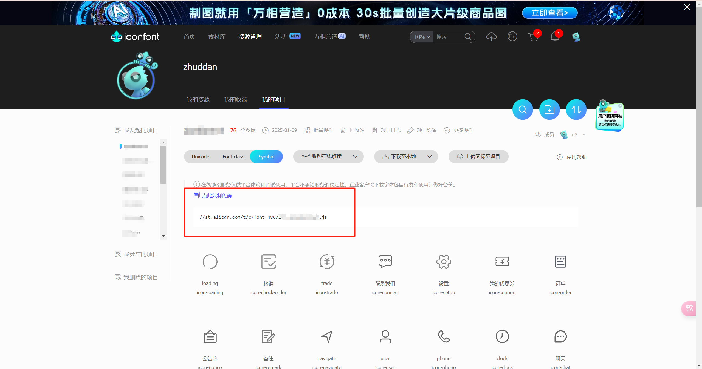

# @zd~/iconfont-cli

一个基于[iconfont](https://www.iconfont.cn/)自动生成`react`/`vue`组件的cli。

## 特点

- 配置简单
- 动态生成
- 类型健全(即使你不使用ts)
- 可自定义组件

## 如何使用

1. 复制你的Symbol字体图标的在线js链接(确保可以访问)



2. 运行命令

```shell

npx @zd~/iconfont-cli@latest

```

3. 根据命令提示填写你的配置提示

- 请输入Symbol字体图标的在线js链接
- 请选择一个框架 (react/vue)
- 是否使用ts (yes/no)
- Iconfont 组件路径文件夹 (默认 src/components/iconfont)
- 是否具名导出每一个图标组件 (仅仅 react 可用)
- 具名导出组件的组件前缀 (仅仅 react 可用)

然后会在你的执行命令的文件夹下生成一个`iconfont-cli-config.json`文件

```
{
  "jsLink": "//at.alicdn.com/t/c/你的链接.js",
  "framework": "react",
  "useTs": true,
  "iconfontPath": "src/components/iconfont",
  "set": true,
  "iconPrefix": "icon"
}
```

4. 最后他会在 `src/components/iconfont` 目录下生成相应的组件文件

以上面配置为例

src/components/iconfont/iconfont-data.ts

```ts
/**
 * 图标 svg 数据
 */
const iconfontData = {
  loading: '...'
}
```

src/components/iconfont/iconfont-set.tsx

```tsx
import { ComponentProps } from 'react'
import { Iconfont } from '.'

type CommonIconfontProps = Omit<ComponentProps<typeof Iconfont>, 'name'>

/**
 * IconLoading iconfont component wrapper
 *
 * 
 */
export function IconLoading(props: CommonIconfontProps) {
  return <Iconfont name="loading" {...props} />
}
```

src/components/iconfont/iconfont-types.ts

```tsx
/**
 * 图标名称
 */
export type IconfontTypes = 'loading' | 'check-order' | 'trade' | 'connect' | 'setup' | 'coupon' | 'order' | 'notice' | 'remark' | 'navigate' | 'user' | 'phone' | 'clock' | 'chat' | 'store' | 'star' | 'star-fill' | 'close' | 'shop' | 'location' | 'down' | 'left' | 'plus' | 'right' | 'search' | 'up'
```

src/components/iconfont/iconfont.tsx

```tsx
import type { CSSProperties, HTMLAttributes } from 'react'
import type { IconfontType } from './iconfont-types'
import clsx from 'clsx'
import { useMemo } from 'react'
import data from './iconfont-data'

interface IconfontProps extends HTMLAttributes<HTMLDivElement> {
  size?: number
  color?: string
  name: IconfontType
}

export function Iconfont({
  size,
  color = '#000000',
  name,
  style,
  className,
  ...rest
}: IconfontProps) {
  const mask = useMemo(() => {
    return `url("data:image/svg+xml;charset=utf-8,${encodeURIComponent(data[name])}")`
  }, [name])
  const innerStyle = useMemo(() => {
    const _size = size ? `${size}px` : '1em'
    return {
      ...style,
      'mask': mask,
      // eslint-disable-next-line ts/ban-ts-comment
      // @ts-expect-error
      '-webkit-mask': mask,
      'mask-size': _size,
      'width': _size,
      'height': _size,
      'backgroundColor': color,
      'display': 'inline-block',
    } satisfies CSSProperties
  }, [color, mask, size, style])
  return (
    <div
      className={clsx('iconfont', className)}
      style={innerStyle}
      {...rest}
    >
    </div>
  )
}
```

5. 配置文件存在之后，更新了图标只用再次执行下面配置即可

```shell

npx @zd~/iconfont-cli@latest

```

> 注意组件文件(react 为 iconfont.jsx 或者 iconfont.tsx, vue 为 iconfont.vue) 只会创建一次！
> 目的是你可以自己修改组件细节，例如你使用小程序需要把默认单位调整为`rpx`
> 如果需要覆盖文件重新创建请是使用`npx @zd~/iconfont-cli@latest --force`
